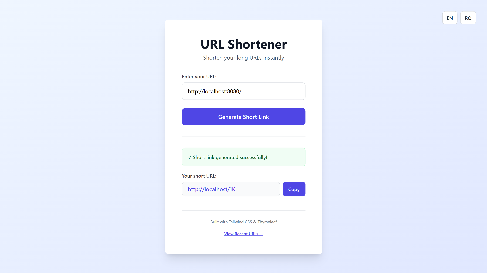
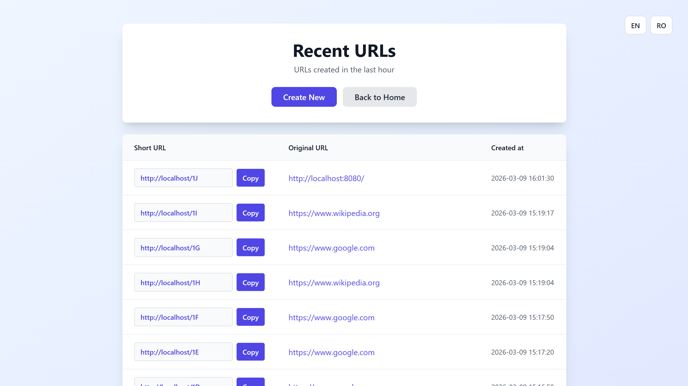

# 🔗 URL Shortener [](https://sonarcloud.io/summary/new_code?id=Yashmerino_url-shortener)

A modern, high-performance URL shortening service built with **Spring Boot 4** and **Thymeleaf**, featuring caching with Redis and PostgreSQL persistence and real-time observability stack via Prometheus & Grafana.

## Features

- 🚀 **Fast URL Generation** - Base62 encoding for short codes
- 💾 **Persistent Storage** - PostgreSQL database with Flyway migrations
- ⚡ **Redis Caching** - Blazing-fast redirects
- 🌐 **Multi-language** - English & Romanian support
- 📊 **Monitoring** - Prometheus metrics & Actuator endpoints
- 🐳 **Containerized** - Docker & Docker Compose ready
- 🧪 **E2E Testing** - Playwright automation tests
- 🔄 **CI/CD** - GitHub Actions workflows

## Screenshots




## Quick Start

### Prerequisites

- Java 24+
- PostgreSQL 16
- Redis 7
- Docker & Docker Compose

### Local Development

```bash
# 1. Clone repository
git clone https://github.com/yashmerino/url-shortener.git
cd url-shortener

# 2. Start services (Docker)
docker-compose -f development/docker-compose.yml up

# 3. Open browser
open http://localhost:8080
```

## Development

See [DEVELOPMENT.md](DEVELOPMENT.md) for:
- Setting up development environment
- Running tests
- Database migrations
- Code structure

## Testing

See [E2E Tests README](e2e-tests/README.md) for details.

## CI/CD

GitHub Actions workflows:
- **Unit Tests** - Runs on every push/PR
- **E2E Tests** - Browser automation tests
